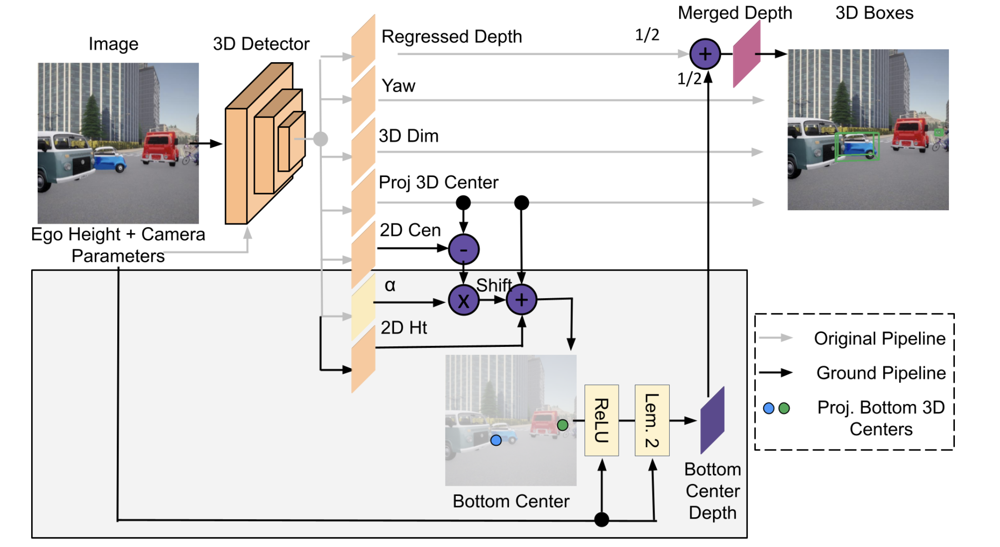
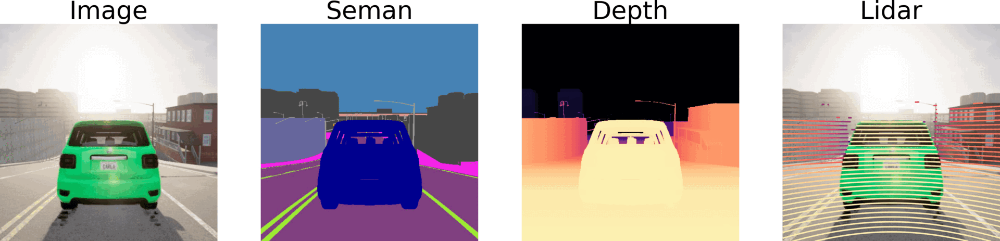

<div align="center">


# [CHARM3R: Towards Unseen Camera Height Robust Monocular 3D Detector](https://arxiv.org/pdf/2508.11185)

### [Project] | [Talk] | [Slides] | [Poster]

[](https://arxiv.org/abs/2508.11185)
[](https://opensource.org/licenses/MIT)
[](https://visitorbadge.io/status?path=abhi1kumar%2FCHARM3R)
[](https://github.com/abhi1kumar/SeaBird)


   <p style="font-size:1.2em">
      <a href="https://sites.google.com/view/abhinavkumar"><strong>Abhinav Kumar</strong></a><sup>1</sup> ·
      <a href="https://yuliangguo.github.io"><strong>Yuliang Guo</strong></a><sup>2</sup> ·
      <a href="https://alanzhangcs.github.io/"><strong>Zhihao Zhang</strong></a><sup>1</sup> ·
      <a href="https://scholar.google.com/citations?user=cL4bNBwAAAAJ&hl=en"><strong>Xinyu Huang</strong></a><sup>2</sup> ·
      <a href="https://www.liu-ren.com"><strong>Liu Ren</strong></a><sup>2</sup> ·
      <a href="http://www.cse.msu.edu/~liuxm/index2.html"><strong>Xiaoming Liu</strong></a><sup>1</sup><br>
      <sup>1</sup>Michigan State University, <sup>2</sup>Bosch Research North America, Bosch Center for AI
   </p>

in [ICCV 2025](https://iccv.thecvf.com/Conferences/2025)
    <p align="center">
      
      
      
   </p>
</div>

> Monocular 3D object detectors, while effective on data from one ego camera height, struggle with unseen or out-of-distribution camera heights. Existing methods often rely on Plucker embeddings, image transformations or data augmentation. This paper takes a step towards this under-studied problem by first investigating the impact of camera height variations on state-of-the-art (SoTA) Mono3D models. With a systematic analysis on the extended CARLA dataset with multiple camera heights, we observe that depth estimation is a primary factor influencing performance under height variations. We mathematically prove and also empirically observe consistent negative and positive trends in mean depth error of regressed and ground-based depth models, respectively, under camera height changes. To mitigate this, we propose Camera Height Robust Monocular 3D Detector (CHARM3R), which averages both depth estimates within the model. CHARM3R improves generalization to unseen camera heights by more than 45%, achieving SoTA performance on the CARLA dataset.

Much of the codebase is based on [DEVIANT](https://github.com/abhi1kumar/DEVIANT). Some implementations are from [GrooMeD-NMS](https://github.com/abhi1kumar/groomed_nms).
CARLA rendering code is available at [CARLA_Rendering](https://github.com/abhi1kumar/CARLA_rendering), which we adapt from [Viewpoint-Robustness](https://github.com/NVlabs/viewpoint-robustness).

## Citation

If you find our work useful in your research, please consider starring the repo and citing:

```Bibtex
@inproceedings{kumar2025charm3r,
   title={{CHARM3R: Towards Unseen Camera Height Robust Monocular $3$D Detector}},
   author={Kumar, Abhinav and Guo, Yuliang and Zhang, Zhihao and Huang, Xinyu and Ren, Liu and Liu, Xiaoming},
   booktitle={ICCV},
   year={2025}
}
```

## Setup

- **Requirements**

    1. Python 3.7
    2. [PyTorch](http://pytorch.org) 1.10
    3. Torchvision 0.11
    4. Cuda 11.3
    5. Ubuntu 18.04/Debian 8.9

This is tested with NVIDIA A100 GPU. Other platforms have not been tested. Clone the repo first. Unless otherwise stated, the below scripts and instructions assume the working directory is the directory `CHARM3R`:

```bash
git clone https://github.com/abhi1kumar/CHARM3R.git
cd CHARM3R
```

- **Cuda & Python**

Build the DEVIANT environment by installing the requirements:

```bash
conda create --name CHARM3R --file conda_GUP_environment_a100.txt
conda activate CHARM3R
pip install opencv-python pandas kornia==0.6.6
```

- **CARLA, CODa, KITTI, nuScenes and Waymo Data**

Follow instructions of [data_setup_README.md](data/data_setup_README.md) to setup CARLA, CODa, KITTI, nuScenes and Waymo as follows:

```bash
CHARM3R
├── data
│      ├── carla
│      │      ├── ImageSets
│      │      ├── height0
│      │      │      ├── training
│      │      │      │     ├── calib
│      │      │      │     ├── image
│      │      │      │     └── label
│      │      │      │
│      │      │      └── validation
│      │      │            ├── calib
│      │      │            ├── image
│      │      │            └── label
│      │      ├── height-6
│      │      ├── height6
│      │      ├── height-12
│      │      ├── height12
│      │      ├── height-18
│      │      ├── height18
│      │      ├── height-24
│      │      ├── height24
│      │      ├── height-27
│      │      └── height30
│      │             ├── training
│      │             │     ├── calib
│      │             │     ├── image
│      │             │     └── label
│      │             │
│      │             └── validation
│      │                   ├── calib
│      │                   ├── image
│      │                   └── label
│      │
│      ├── coda
│      │      ├── ImageSets
│      │      ├── training
│      │      │     ├── calib
│      │      │     ├── image_2
│      │      │     └── label_2
│      │      │
│      │      └── testing
│      │            ├── calib
│      │            ├── image_2
│      │            └── label_2
│      ├── KITTI
│      │      ├── ImageSets
│      │      ├── kitti_split1
│      │      ├── training
│      │      │     ├── calib
│      │      │     ├── image_2
│      │      │     └── label_2
│      │      │
│      │      └── testing
│      │            ├── calib
│      │            └── image_2
│      │
│      ├── nusc_kitti
│      │      ├── ImageSets
│      │      ├── training
│      │      │     ├── calib
│      │      │     ├── image
│      │      │     └── label
│      │      │
│      │      └── validation
│      │            ├── calib
│      │            ├── image
│      │            └── label
│      │
│      └── waymo
│             ├── ImageSets
│             ├── training
│             │     ├── calib
│             │     ├── image
│             │     └── label
│             │
│             └── validation
│                   ├── calib
│                   ├── image
│                   └── label
│
├── experiments
├── images
├── lib
├── nuscenes-devkit        
│ ...
```


- **AP Evaluation**

Run the following to generate the KITTI binaries corresponding to `R40`:

```bash
sudo apt-get install libopenblas-dev libboost-dev libboost-all-dev gfortran
sh data/KITTI/kitti_split1/devkit/cpp/build.sh
```

We finally setup the Waymo evaluation. The Waymo evaluation is setup in a different environment `py36_waymo_tf` to avoid package conflicts with our CHARM3R environment:

```bash
# Set up environment
conda create -n py36_waymo_tf python=3.7
conda activate py36_waymo_tf
conda install cudatoolkit=11.3 -c pytorch

# Newer versions of tf are not in conda. tf>=2.4.0 is compatible with conda.
pip install tensorflow-gpu==2.4
conda install pandas
pip3 install waymo-open-dataset-tf-2-4-0 --user
```

To verify that your Waymo evaluation is working correctly, pass the ground truth labels as predictions for a sanity check. Type the following:

```bash
/mnt/home/kumarab6/anaconda3/envs/py36_waymo_tf/bin/python -u data/waymo/waymo_eval.py --sanity
```

You should see AP numbers as 100 in every entry after running this sanity check.


## Training

Train the model:

```bash
chmod +x scripts_training.sh
./scripts_training.sh
```

## Testing Pre-trained Models

### Model Zoo

We provide logs/models/predictions for the main experiments on CARLA data splits available to download here.

| Data_Splits | Method  | Config<br/>(Run)                                          | Weight<br>/Pred  | Metrics | All<br/>(0.7) | -0.70m<br/>(-0.7) | 0.0m<br/>(0.7) | 0.76m<br/>(0.7) |All<br/>(0.5) | -0.70<br/>(0.5) | 0.0<br/>(0.5) | 0.76<br/>(0.5) | 
|------------|---------|------------------------------------------------------------------|----------|--------|----------|-----------|----------|-----------|----------------|----|--------------|-----------|
| CARLA Val  | GUP Net | [gup_dla34](experiments/carla_gup_dla34_height0.yaml) | [gdrive](https://drive.google.com/file/d/1nHyx84azFI4xQqQi1YMDhaB2Z6BS0NRx/view?usp=sharing)     | AP40  |   -   | 9.46 | 53.82 | 7.23 |   -   |   41.66   |   76.47   |   40.97   
| CARLA Val  | +CHARM3R | [charm3r_gup](experiments/carla_charm3r_gup_dla34.yaml) | [gdrive](https://drive.google.com/file/d/1O9FFqJMhrXYl63Bc28toLVDq3rGlTX0P/view?usp=sharing)     | AP40  |   -   | 19.45 | 55.68 | 27.33 |   -   |   53.40   |   74.47   |   61.98 
| CARLA Val  | DEVIANT | [dev_dla34](experiments/carla_dev_dla34_height0.yaml) | [gdrive](https://drive.google.com/file/d/1xiXzsBB7JVPnOCJmdDuY_G4DDhB1ap3j/view?usp=sharing) | AP40  |   -   | 8.63 | 50.18 | 6.25 |   -   | 40.24 | 73.78 | 41.74 
| CARLA Val  | +CHARM3R | [charm3r_dev](experiments/carla_charm3r_dev_dla34.yaml) | [gdrive](https://drive.google.com/file/d/1Fj_nJ19o0EhiI_4hFaCAA9nz-x7a6__s/view?usp=sharing)     | AP40  |   -   | 17.11 | 48.74 | 26.24 |   -   | 49.28 | 70.21 | 63.60

### Testing

Make `output` folder in the `CHARM3R` directory:

```bash
mkdir output
```
Place models in the `output` folder as follows:

```bash
CHARM3R
├── output
│      ├── carla_charm3r_dev_dla34
│      ├── carla_charm3r_gup_dla34
│      ├── carla_dev_dla34_height0
│      └── carla_gup_dla34_height0
│
│ ...
```

Then, to test, run the file as:

```bash
chmod +x scripts_inference.sh
./scripts_inference.sh
```

### Qualitative Plots/Visualization

To get qualitative plots and visualize the predicted+GT boxes, type the following:

```bash
python plot/plot_qualitative_output.py --dataset carla --folder output/carla_charm3r_gup_dla34/results_test/data
```


Type the following to reproduce our other plots:

```bash
python plot/plot_performance_with_height.py
```

## FAQ

- **Inference on older cuda version** For inference on older cuda version, type the following before running inference:

```bash
source cuda_9.0_env
```

- **Correct Waymo version** You should see a 16th column in each ground truth file inside `data/waymo/validation/label/`. This corresponds to the `num_lidar_points_per_box`. If you do not see this column, run:

```bash
cd data/waymo
python waymo_check.py 
```

to see if `num_lidar_points_per_box` is printed. If nothing is printed, you are using the wrong Waymo dataset version and you should download the correct dataset version.

- **Cannot convert a symbolic Tensor (strided_slice:0) to a numpy array**  This error indicates that you're trying to pass a Tensor to a NumPy call". This means you have a wrong numpy version. Install the correct numpy as:

```bash
pip install numpy==1.19.5
```

## Acknowledgements
We thank the authors of the following awesome codebases:
- [DEVIANT](https://github.com/abhi1kumar/DEVIANT)
- [SeaBird](https://github.com/abhi1kumar/SeaBird)
- [GrooMeD-NMS](https://github.com/abhi1kumar/groomed_nms)
- [CARLA_Rendering](https://github.com/abhi1kumar/CARLA_rendering)
- [Viewpoint-Robustness](https://github.com/NVlabs/viewpoint-robustness)

Please also consider citing and starring them.

## Contributions
We welcome contributions to the CHARM3R repo. Feel free to raise a pull request.

### &#8627; Stargazers
[](https://github.com/abhi1kumar/CHARM3R/stargazers)

### &#8627; Forkers
[](https://github.com/abhi1kumar/CHARM3R/network/members)


## License
CHARM3R code is under the [MIT license](https://opensource.org/license/mit).

## Contact
For questions, feel free to post here or drop an email to this address- ```abhinav3663@gmail.com```
